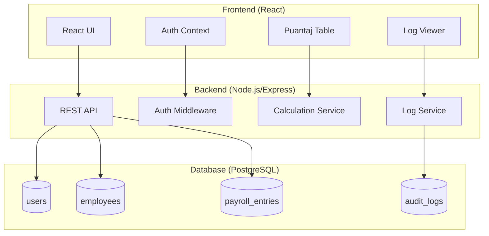

# Design Document: Puantaj Uygulaması

## Overview

Bu tasarım, Excel benzeri bir puantaj (timesheet) web uygulamasının teknik mimarisini tanımlar. Uygulama React frontend, Node.js/Express backend ve PostgreSQL veritabanı kullanarak çalışan yönetimi, otomatik maaş hesaplamaları ve kapsamlı işlem geçmişi (audit log) özellikleri sunar.

Sistem üç ana katmandan oluşur:
1. **Sunum Katmanı**: React tabanlı Excel benzeri tablo arayüzü
2. **İş Mantığı Katmanı**: Node.js/Express REST API
3. **Veri Katmanı**: PostgreSQL veritabanı

## Architecture



### Teknoloji Stack

| Katman | Teknoloji | Amaç |
|--------|-----------|------|
| Frontend | React 18 | UI bileşenleri |
| State Management | React Context | Global state (auth) |
| Styling | Tailwind CSS | Hızlı UI geliştirme |
| Backend | Node.js + Express | REST API |
| ORM | Prisma | Veritabanı erişimi |
| Auth | JWT + bcrypt | Kimlik doğrulama |
| Database | PostgreSQL | Veri depolama |
| Validation | Zod | Schema validation |

## Components and Interfaces

### Backend API Endpoints

```typescript
// Auth Endpoints
POST   /api/auth/login     // Kullanıcı girişi
POST   /api/auth/logout    // Çıkış
GET    /api/auth/me        // Mevcut kullanıcı bilgisi

// Employee Endpoints
GET    /api/employees      // Tüm çalışanları listele
POST   /api/employees      // Yeni çalışan ekle
PUT    /api/employees/:id  // Çalışan güncelle
DELETE /api/employees/:id  // Çalışan sil

// Payroll Endpoints
GET    /api/payroll        // Puantaj verilerini getir (ay/yıl parametreli)
PUT    /api/payroll/:id    // Puantaj kaydı güncelle
POST   /api/payroll/batch  // Toplu güncelleme

// Log Endpoints
GET    /api/logs           // Log kayıtlarını listele (pagination)
GET    /api/logs/:entityId // Belirli kayda ait loglar
```

### Frontend Components

```typescript
// Ana Bileşenler
<App />
├── <AuthProvider />
│   ├── <LoginPage />
│   └── <ProtectedRoute />
│       ├── <Layout />
│       │   ├── <Navbar />
│       │   └── <MainContent />
│       │       ├── <EmployeeListPage />
│       │       ├── <PayrollTablePage />
│       │       │   ├── <PayrollTable />
│       │       │   │   ├── <TableHeader />
│       │       │   │   ├── <TableRow />
│       │       │   │   └── <EditableCell />
│       │       │   └── <CalculationSummary />
│       │       └── <LogViewerPage />
│       │           ├── <LogList />
│       │           └── <LogEntry />
```

### Core Interfaces

```typescript
// Çalışan
interface Employee {
  id: string;
  fullName: string;
  workArea: WorkArea;
  isInsured: boolean;
  startDate: Date;
  endDate?: Date;
  salary: number;
  workingDays: number; // Varsayılan 30
  createdAt: Date;
  updatedAt: Date;
}

type WorkArea = 'DEPO' | 'URETIM' | 'OFIS' | 'DIGER';

// Puantaj Kaydı
interface PayrollEntry {
  id: string;
  employeeId: string;
  month: number;
  year: number;
  daysWorked: number;
  advance: number;
  overtime50: number;
  overtime100: number;
  officialPayment: number;
  cashPayment: number;
  // Hesaplanan alanlar
  dailyWage: number;
  earnedSalary: number;
  totalReceivable: number;
  createdAt: Date;
  updatedAt: Date;
}

// Audit Log
interface AuditLog {
  id: string;
  userId: string;
  userName: string;
  action: 'CREATE' | 'UPDATE' | 'DELETE';
  entityType: 'EMPLOYEE' | 'PAYROLL';
  entityId: string;
  entityName: string;
  changes: FieldChange[];
  timestamp: Date;
}

interface FieldChange {
  field: string;
  oldValue: string | null;
  newValue: string | null;
}

// Kullanıcı
interface User {
  id: string;
  username: string;
  passwordHash: string;
  role: 'ADMIN' | 'USER';
  createdAt: Date;
}
```

## Data Models

### PostgreSQL Schema (Prisma)

```prisma
model User {
  id           String     @id @default(uuid())
  username     String     @unique
  passwordHash String
  role         Role       @default(USER)
  createdAt    DateTime   @default(now())
  auditLogs    AuditLog[]
}

enum Role {
  ADMIN
  USER
}

model Employee {
  id           String         @id @default(uuid())
  fullName     String
  workArea     WorkArea
  isInsured    Boolean        @default(false)
  startDate    DateTime
  endDate      DateTime?
  salary       Decimal        @db.Decimal(10, 2)
  workingDays  Int            @default(30)
  createdAt    DateTime       @default(now())
  updatedAt    DateTime       @updatedAt
  payrollEntries PayrollEntry[]
}

enum WorkArea {
  DEPO
  URETIM
  OFIS
  DIGER
}

model PayrollEntry {
  id              String   @id @default(uuid())
  employeeId      String
  employee        Employee @relation(fields: [employeeId], references: [id], onDelete: Cascade)
  month           Int
  year            Int
  daysWorked      Int      @default(0)
  advance         Decimal  @db.Decimal(10, 2) @default(0)
  overtime50      Decimal  @db.Decimal(10, 2) @default(0)
  overtime100     Decimal  @db.Decimal(10, 2) @default(0)
  officialPayment Decimal  @db.Decimal(10, 2) @default(0)
  cashPayment     Decimal  @db.Decimal(10, 2) @default(0)
  createdAt       DateTime @default(now())
  updatedAt       DateTime @updatedAt

  @@unique([employeeId, month, year])
}

model AuditLog {
  id         String   @id @default(uuid())
  userId     String
  user       User     @relation(fields: [userId], references: [id])
  action     Action
  entityType EntityType
  entityId   String
  entityName String
  changes    Json     // FieldChange[] olarak serialize edilir
  timestamp  DateTime @default(now())

  @@index([entityType, entityId])
  @@index([timestamp])
}

enum Action {
  CREATE
  UPDATE
  DELETE
}

enum EntityType {
  EMPLOYEE
  PAYROLL
}
```

### Calculation Service

```typescript
// Hesaplama fonksiyonları - saf fonksiyonlar olarak tasarlanmıştır
interface CalculationInput {
  salary: number;
  workingDays: number;
  daysWorked: number;
  advance: number;
  overtime50: number;
  overtime100: number;
  officialPayment: number;
  cashPayment: number;
}

interface CalculationResult {
  dailyWage: number;
  earnedSalary: number;
  totalReceivable: number;
}

function calculatePayroll(input: CalculationInput): CalculationResult {
  const dailyWage = input.salary / input.workingDays;
  const earnedSalary = dailyWage * input.daysWorked;
  const totalReceivable = 
    earnedSalary + 
    input.overtime50 + 
    input.overtime100 - 
    input.advance - 
    input.officialPayment - 
    input.cashPayment;
  
  return { dailyWage, earnedSalary, totalReceivable };
}
```

### Log Service

```typescript
// Log oluşturma fonksiyonu
interface CreateLogInput {
  userId: string;
  userName: string;
  action: 'CREATE' | 'UPDATE' | 'DELETE';
  entityType: 'EMPLOYEE' | 'PAYROLL';
  entityId: string;
  entityName: string;
  oldData?: Record<string, unknown>;
  newData?: Record<string, unknown>;
}

function createAuditLog(input: CreateLogInput): AuditLog {
  const changes = computeChanges(input.oldData, input.newData);
  return {
    id: generateUUID(),
    userId: input.userId,
    userName: input.userName,
    action: input.action,
    entityType: input.entityType,
    entityId: input.entityId,
    entityName: input.entityName,
    changes,
    timestamp: new Date()
  };
}

function computeChanges(
  oldData?: Record<string, unknown>, 
  newData?: Record<string, unknown>
): FieldChange[] {
  // CREATE: tüm yeni alanlar
  // DELETE: tüm eski alanlar
  // UPDATE: değişen alanlar
}
```


## Correctness Properties

*A property is a characteristic or behavior that should hold true across all valid executions of a system—essentially, a formal statement about what the system should do. Properties serve as the bridge between human-readable specifications and machine-verifiable correctness guarantees.*

### Property 1: Password Hashing Security

*For any* user password, storing it in the database and then verifying it should work correctly: the stored hash should never equal the plaintext password, and bcrypt.compare(plaintext, hash) should return true.

**Validates: Requirements 1.5**

### Property 2: Invalid Credentials Rejection

*For any* username/password combination where either the username doesn't exist or the password is incorrect, the authentication system should reject the login attempt and return an error.

**Validates: Requirements 1.2**

### Property 3: Employee CRUD Round-Trip

*For any* valid employee data, creating an employee and then retrieving it should return equivalent data. Updating an employee and retrieving it should reflect the updates. Deleting an employee should make it no longer retrievable.

**Validates: Requirements 2.1, 2.2, 2.3**

### Property 4: Payroll Data Persistence

*For any* valid payroll entry with numeric fields (daysWorked, advance, overtime50, overtime100, officialPayment, cashPayment), saving the entry and retrieving it should return the same values.

**Validates: Requirements 4.1, 4.2, 4.3, 4.4, 4.5, 4.6**

### Property 5: Numeric Field Validation

*For any* payroll input field, the system should reject negative numbers and non-numeric values, maintaining the previous valid state.

**Validates: Requirements 4.7**

### Property 6: Calculation Correctness

*For any* valid calculation input (salary > 0, workingDays > 0, daysWorked >= 0, and non-negative payment fields):
- dailyWage should equal salary / workingDays
- earnedSalary should equal dailyWage * daysWorked
- totalReceivable should equal earnedSalary + overtime50 + overtime100 - advance - officialPayment - cashPayment

**Validates: Requirements 5.1, 5.2, 5.3**

### Property 7: Audit Log Creation

*For any* CREATE, UPDATE, or DELETE operation on Employee or Payroll entities, an audit log entry should be created containing: valid userId, correct action type, correct entityType, valid entityId, non-empty entityName, and timestamp within acceptable range of operation time.

**Validates: Requirements 6.1, 6.2, 6.3, 6.4, 6.5, 6.6**

### Property 8: Log Serialization Round-Trip

*For any* valid AuditLog object with FieldChange array, serializing to JSON and deserializing back should produce an equivalent object.

**Validates: Requirements 6.7**

## Error Handling

### Backend Error Handling

```typescript
// Standart hata yanıt formatı
interface ApiError {
  status: number;
  code: string;
  message: string;
  details?: Record<string, string[]>;
}

// HTTP Status Codes
// 400 - Bad Request: Geçersiz girdi
// 401 - Unauthorized: Kimlik doğrulama gerekli
// 403 - Forbidden: Yetki yok
// 404 - Not Found: Kayıt bulunamadı
// 409 - Conflict: Çakışma (duplicate)
// 500 - Internal Server Error: Sunucu hatası
```

### Validation Errors

| Alan | Kural | Hata Mesajı |
|------|-------|-------------|
| fullName | Boş olamaz | "Ad soyad zorunludur" |
| salary | Pozitif sayı | "Maaş pozitif bir sayı olmalıdır" |
| daysWorked | 0-31 arası | "Çalışılan gün 0-31 arasında olmalıdır" |
| advance | Negatif olamaz | "Avans negatif olamaz" |
| startDate | Geçerli tarih | "Geçerli bir tarih giriniz" |

### Frontend Error Handling

- API hatalarını kullanıcı dostu mesajlara çevir
- Form validation hatalarını alan bazlı göster
- Network hatalarında retry mekanizması
- Optimistic update başarısız olursa rollback

## Testing Strategy

### Test Türleri

Bu projede iki tür test kullanılacaktır:

1. **Unit Tests**: Belirli örnekler ve edge case'ler için
2. **Property-Based Tests**: Evrensel özellikler için (tüm geçerli girdilerde doğru olmalı)

### Property-Based Testing Framework

- **Library**: fast-check (TypeScript/JavaScript için)
- **Minimum iterations**: 100 per property
- **Tag format**: `Feature: puantaj-app, Property {number}: {property_text}`

### Test Coverage

| Property | Test Türü | Dosya |
|----------|-----------|-------|
| Property 1: Password Hashing | Property-based | `auth.property.test.ts` |
| Property 2: Invalid Credentials | Property-based | `auth.property.test.ts` |
| Property 3: Employee CRUD | Property-based | `employee.property.test.ts` |
| Property 4: Payroll Persistence | Property-based | `payroll.property.test.ts` |
| Property 5: Numeric Validation | Property-based | `validation.property.test.ts` |
| Property 6: Calculation | Property-based | `calculation.property.test.ts` |
| Property 7: Audit Log | Property-based | `auditlog.property.test.ts` |
| Property 8: Log Serialization | Property-based | `auditlog.property.test.ts` |

### Unit Test Coverage

- Login/logout flow examples
- Edge cases: empty strings, boundary values
- Error condition examples
- Integration points between components

### Test Configuration

```typescript
// fast-check configuration
fc.configureGlobal({
  numRuns: 100,
  verbose: true
});
```
